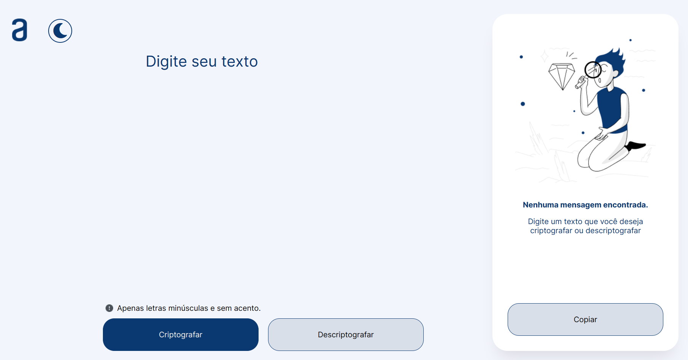

# Decodificador de texto com JavaScript

  

 

Esse projeto foi desenvolvido para conclusão da Formação em Programação (Programa ONE - Oracle Next Education) promovida com a parceria Oracle + Alura.

## Sobre o Programa ONE

O Programa ONE é uma iniciativa de educação e empregabilidade com um forte impacto social. Seu objetivo é capacitar pessoas em tecnologia e conectá-las com o mercado de trabalho por meio de parcerias com empresas.

Cada geração de alunos passa por uma jornada de 6 meses, dividida em 4 trilhas disponibilizadas na plataforma. Ao todo, são mais de 560 horas de conteúdo prático e experiencial.

---

Para acessar o projeto basta clicar [AQUI](https://juniord-dev.github.io/decodificador-javascript/)! 😉
